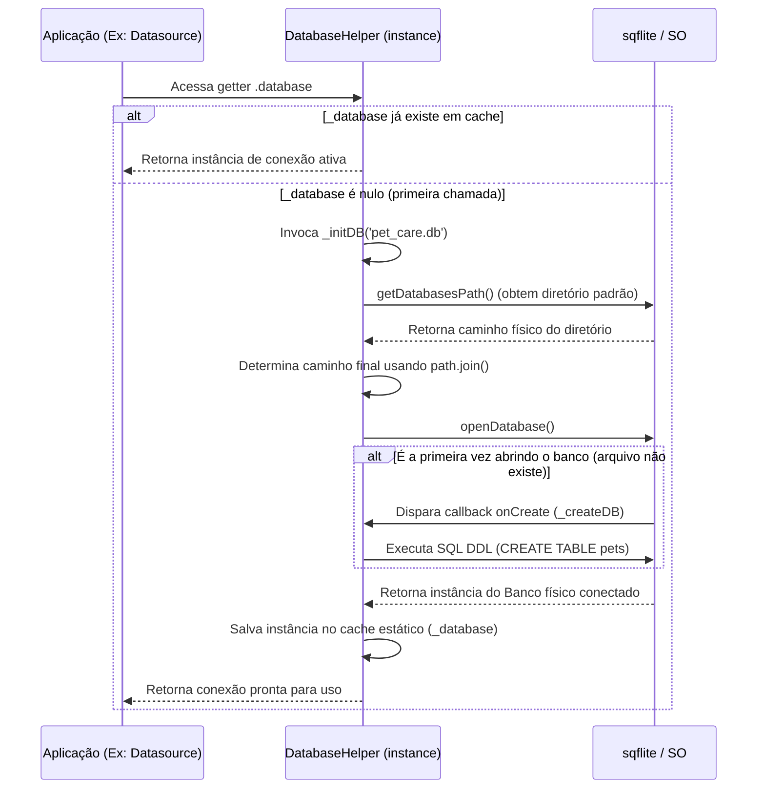

# 🐾 Pet Care — Gestão Inteligente Offline-First

O **Pet Care** é uma aplicação Flutter moderna e robusta, projetada para a gestão simplificada de pets e tutores. Focada no paradigma **offline-first**, a aplicação utiliza o banco de dados local SQLite por meio do pacote `sqflite` para garantir a persistência de dados ágil e independente de conectividade.

O projeto adota práticas avançadas de desenvolvimento de software, incluindo uma **Arquitetura Baseada em Recursos (Feature-First)** altamente modular, **Exclusão Lógica (Soft Delete)** automatizada na camada de dados e uma interface de usuário refinada baseada em **Design Tokens** elegantes.

---

## 🛠️ Tecnologias e Dependências

- **Framework:** [Flutter](https://flutter.dev) (Suporte nativo para Android, iOS e Web)
- **Linguagem:** Dart (SDK `^3.11.0`)
- **Persistência Local:** [sqflite (`^2.4.2+1`)](https://pub.dev/packages/sqflite)
- **Manipulação de Arquivos e Caminhos:** [path (`^1.9.1`)](https://pub.dev/packages/path)
- **Estilização e Análises:** [flutter_lints (`^6.0.0`)](https://pub.dev/packages/flutter_lints)

---

## ✨ Funcionalidades Principais

* **👥 Gestão Completa de Tutores (CRUD):** Cadastro estruturado contendo nome, e-mail e telefone, com validações de dados rigorosas.
* **🐕 Gestão Avançada de Pets (CRUD):** Vinculação direta de pets a tutores cadastrados (relacionamento 1:N), persistindo informações como nome e espécie.
* **🛡️ Proteção de Exclusão Cascata (Segurança Relacional):** Validação relacional integrada que impede a remoção de um tutor caso ele possua pets ativos sob sua custódia, prevenindo a ocorrência de dados órfãos.
* **♻️ Mecanismo de Soft Delete:** Deleção lógica usando a coluna `deletedAt`. Os registros são preservados fisicamente, mas omitidos das consultas normais através de cláusulas SQL especializadas (`deletedAt IS NULL`).
* **📱 UI/UX de Alto Padrão (Premium):** 
  - Listagens com gesto interativo *Swipe-to-Dismiss* para remoção rápida.
  - Diálogos personalizados com dupla confirmação para ações destrutivas.
  - Navegação fluida utilizando um painel lateral (`AppDrawer`) com indicadores visuais de estado ativo.
  - Notificações flutuantes (`Snackbars`) estilizadas para feedback operacional instantâneo.

---

## 📐 Diretrizes de Arquitetura (Feature-First)

O projeto rejeita a organização puramente técnica (como pastas de telas ou modelos globais na raiz) e segue uma estrutura limpa e desacoplada baseada em **Features**. Isso facilita a extensibilidade do sistema, permitindo que novos módulos sejam criados de forma independente.

```text
lib/
├── core/
│   ├── database/
│   │   ├── database_helper.dart            # Helper Singleton de gerenciamento do SQLite
│   │   └── database_helper_flow.mermaid    # Diagrama de fluxo de ciclo de vida do DB
│   └── presentation/
│       └── widgets/
│           └── app_drawer.dart             # Widget global de navegação lateral
│
├── features/
│   ├── pet/                                # Módulo completo da Feature de Pets
│   │   ├── domain/
│   │   │   ├── models/pet.dart             # Modelo de domínio do Pet
│   │   │   └── repositories/pet_repository.dart # Interface (Contrato) do repositório
│   │   ├── data/
│   │   │   ├── datasources/pet_local_datasource.dart # Queries cruas e mapeamento SQLite
│   │   │   └── repositories/sqlite_pet_repository.dart # Implementação concreta da interface
│   │   └── presentation/
│   │       ├── controllers/pet_controller.dart # Controlador direto sem estado (Stateless)
│   │       └── pages/
│   │           ├── pet_form_page.dart      # Tela de criação e edição
│   │           └── pet_list_page.dart      # Listagem com Swipe-to-Dismiss e busca
│   │
│   └── tutor/                              # Módulo completo da Feature de Tutores
│       ├── domain/
│       │   ├── models/tutor.dart           # Modelo de domínio do Tutor
│       │   └── repositories/tutor_repository.dart # Interface (Contrato) do repositório
│       ├── data/
│       │   ├── datasources/tutor_local_datasource.dart # Queries SQL brutas para tutores
│       │   └── repositories/sqlite_tutor_repository.dart # Implementação concreta da interface
│       └── presentation/
│           ├── controllers/tutor_controller.dart # Controlador com regras de negócio e validações
│           └── pages/
│               ├── tutor_form_page.dart    # Tela de criação e edição
│               └── tutor_list_page.dart    # Listagem de tutores
│
└── main.dart                               # Ponto de inicialização da aplicação
```

### 🧠 Padrão de Controladores Sem Estado (Stateless Direct Controllers)
A fim de otimizar a testabilidade e manter o acoplamento mínimo:
- Os controladores (`PetController`, `TutorController`) funcionam como pontes diretas sem estado em memória. Eles não herdam de classes reativas ou gerentes de estado globais.
- Eles apenas processam a lógica de negócios e as validações, retornando `Future`s diretamente para a camada visual.
- A reatividade local (gerenciamento de estados de carregamento, listagens dinâmicas e erros) é controlada nativamente pelas páginas através de `StatefulWidget`s e atualizações com `setState`.

---

## 🗄️ Modelo e Ciclo de Vida do Banco de Dados (SQLite)

A gerência do banco de dados é feita de maneira assíncrona e inteligente com o padrão Singleton. O ciclo de vida de abertura e inicialização preguiçosa (lazy load) do banco física é o seguinte:



### 📊 Esquema Relacional DDL

O banco ativa chaves estrangeiras por meio do comando `PRAGMA foreign_keys = ON` na inicialização (`onConfigure`).

```sql
-- Tabela de Tutores
CREATE TABLE tutors (
    tutorId INTEGER PRIMARY KEY AUTOINCREMENT,
    nome TEXT NOT NULL,
    email TEXT NOT NULL,
    telefone TEXT NOT NULL,
    createdAt TEXT NOT NULL,
    updatedAt TEXT NOT NULL,
    deletedAt TEXT
);

-- Tabela de Pets
CREATE TABLE pets (
    petId INTEGER PRIMARY KEY AUTOINCREMENT,
    nome TEXT NOT NULL,
    especie TEXT NOT NULL,
    tutorId INTEGER NOT NULL,
    createdAt TEXT NOT NULL,
    updatedAt TEXT NOT NULL,
    deletedAt TEXT,
    FOREIGN KEY (tutorId) REFERENCES tutors (tutorId)
);
```

---

## 🎨 Paleta de Cores e Guias de Estilo (Design Tokens)

O aplicativo segue um estilo visual refinado, com contrastes perfeitamente calibrados para garantir o conforto do usuário e uma navegação prazerosa.

| Token de Cor | Valor Hexadecimal | Uso Recomendado |
| :--- | :--- | :--- |
| **Primary (Teal)** | `#0F766E` | Barras de ferramentas (AppBars), ícones ativos, títulos principais e feedbacks de sucesso. |
| **Secondary (Orange)** | `#F97316` | Botões de ação flutuantes (FABs) de inserção e botões de destaque. |
| **Neutral Background** | `#F8FAFC` | Cor de fundo padrão de páginas (`Scaffold.backgroundColor`). |
| **Text Primary** | `#1E293B` | Títulos de seções, textos de cards e botões principais. |
| **Text Secondary** | `#64748B` | Textos de ajuda, legendas e descrições secundárias. |
| **Border / Divider** | `#E2E8F0` | Divisórias e bordas sutis para separação de conteúdo. |

- **Tipografia:** Fonte **Inter** com fallbacks elegantes do SO.
- **AppBar:** Sem sombras (`elevation: 0`), fundo totalmente limpo na cor de fundo neutro e uma borda inferior minimalista de `1px` de altura (`#E2E8F0`).
- **Diálogo de Exclusão:** Cantos curvos de `24px`, com ícone proeminente de lixeira em um círculo com cor de alerta suave e botões laterais com cantos de `14px` de estilo arredondado.

---

## 🚀 Como Executar o Projeto Localmente

### Pré-requisitos
Certifique-se de que possui as seguintes ferramentas configuradas na sua máquina de desenvolvimento:
- [Flutter SDK](https://flutter.dev/docs/get-started/install) (`^3.11.0` ou posterior)
- Configuração de um simulador ou aparelho físico Android/iOS ou suporte a execução Web ativado.

### Passos para Inicialização

1. **Clone este repositório:**
   ```bash
   git clone https://github.com/evertonfoz/dm_sqlite.git
   cd pet_care
   ```

2. **Instale as dependências declaradas:**
   ```bash
   flutter pub get
   ```

3. **Verifique lints e boas práticas de código:**
   ```bash
   flutter analyze
   ```

4. **Execute a aplicação no emulador/dispositivo:**
   ```bash
   flutter run
   ```

---

## 👥 Contribuição e Autoria

Este projeto foi desenhado sob especificações modernas da disciplina de Desenvolvimento Móvel e representa um excelente caso prático para o estudo e implementação de persistência física baseada em SQLite com arquitetura modular de software e boas práticas de UX.

Desenvolvido por **[Everton Coimbra de Araújo](https://github.com/evertonfoz)**. 🐾
